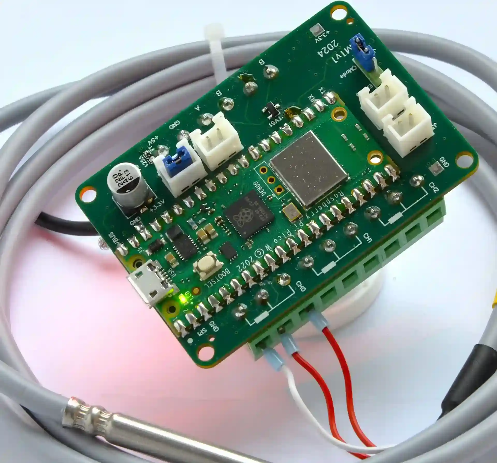
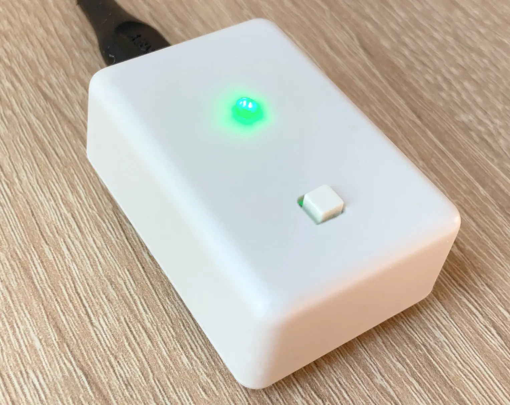

## Hello!

I am a developer from Poland. My work focuses on backend/devops - web related developement and hardware/embedded programming. In addition to coding my projects I also enjoy designing electronics and PCB's for them.

### Linux Cinnamon

I am the creator of two [cinnamon](https://en.wikipedia.org/wiki/Cinnamon_(desktop_environment)) (Linux DE) desklets 
* ⚡ [Quick Links](https://cinnamon-spices.linuxmint.com/desklets/view/76)
* 📋 [TODO Desklet](https://cinnamon-spices.linuxmint.com/desklets/view/79)

I also maintain

* 🕑 [Time and Date Desklet](https://cinnamon-spices.linuxmint.com/desklets/view/9)
* 🔘 [Shutdown Linux](https://cinnamon-spices.linuxmint.com/desklets/view/22)

### Examples of my devices

| PM1 Digital Thermometer                               | Aion2 Desktop timer                           |
| ----------------------------------------------------- | --------------------------------------------- |
|    |           |

